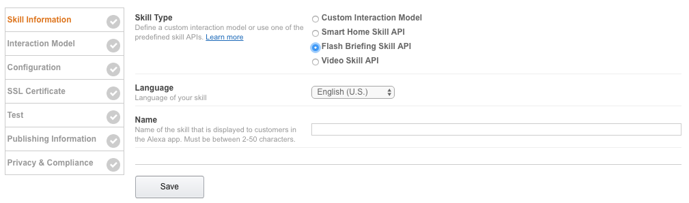

# Build An Alexa Flash Briefing Skill

## Setting up Your Alexa Skill in the Developer Portal

There are two parts to an Alexa flash briefing skill.  The first part is the skill configuration and public facing details.  This is where we define the skill and specify where the skill will access the flash briefing data.  The second part is the combination of the actual code logic and API endpoint for our skill, and we will handle that in the [Lambda Function step](./2-lambda-function.md) of this guide. 

1.  Go to the **[Amazon Developer Portal](http://developer.amazon.com).**  In the top-right corner of the screen, click the **Sign In** button. (If you don't already have an account, you will be able to create a new one for free.)

    

2.  Once you have signed in, click the **Alexa** button at the top of the screen.

	

3.  On the Alexa page, choose the **Get Started** button for the **Alexa Skills Kit**.

	

4.  Select **Add A New Skill**.

	

5.  Fill out the **Skill Information** screen. Make sure to review the **Skill Information Tips** below this screenshot.

	

	### Skill Information Tips

    - **Skill Type** For this skill, we are creating a skill using the Flash Briefing Skill API.
    - **Language** Choose the language you want to support. A Flash Briefing Skill can only support one language. (This guide is using U.S. English to start.) 
    - **Name** This is the name that will be shown in the Alexa Skills Store and the name your users will refer to.

6.  Click the **Save** button, then click on **Next** to move to the **Interaction Model** screen.

	

	> There is no interaction model for a flash briefing skill. 

6.  Click the **Next** button to move to the **Configuration** screen.

	

7.  In our next step of this guide, we will be creating our Lambda function and API endpoint in the AWS developer console.

  

