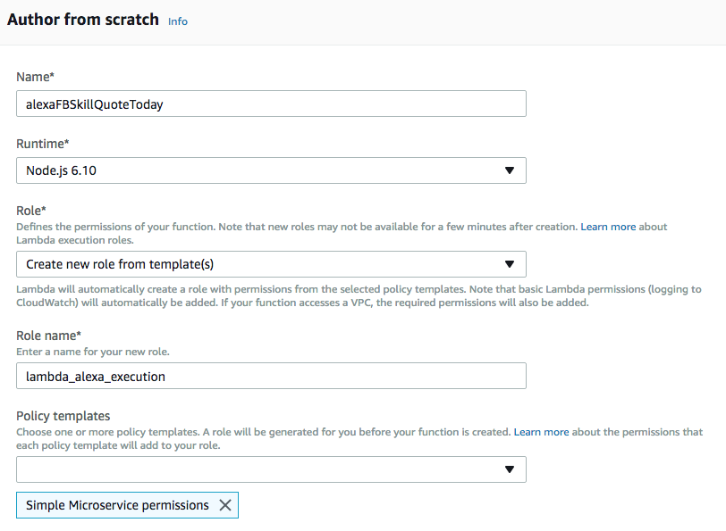
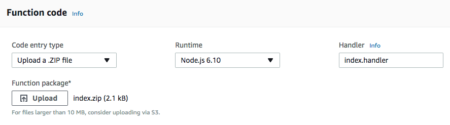
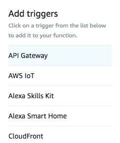
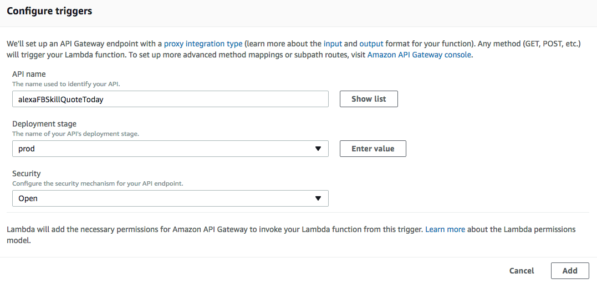
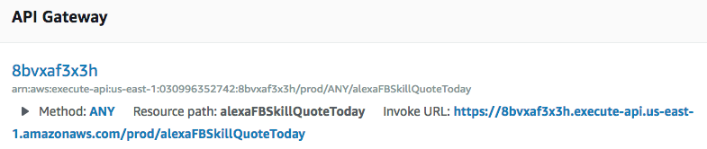

# Build An Alexa Flash Briefing Skill
[](./1-voice-user-interface.md)[](./2-lambda-function.md)[](./3-connect-vui-to-code.md)[](./4-testing.md)[](./5-customization.md)[](./6-publication.md)


## Setting up Your Lambda Function Using Amazon Web Services

In the [Voice User Interface step](../instructions/1-voice-user-interface.md) we created our Alexa skill.  In this step we will be using [Amazon Web Services](http://aws.amazon.com) to  create an AWS Lambda function and then exposing that through the AWS API Gateway. You can read more about [what a Lambda function is](http://aws.amazon.com/lambda), but for the purposes of this guide, what you need to know is that AWS Lambda is where our code lives and that the API Gateway allows our skill to connect to the code. When a user asks Alexa for a flash briefing, our skill will access AWS Lambda function via the API Gateway and provide the results back to the user.

1.  Go to **http://aws.amazon.com** and sign in to the console. [If you don't have an AWS account, check out this quick walkthrough for setting it up](https://github.com/alexa/alexa-cookbook/tree/master/aws/set-up-aws.md).

  <a href="https://console.aws.amazon.com/console/home" target="_new"></a>

2.  Click **Services** at the top of the screen and type **Lambda** in the search box.  Lambda can also be found in the list of services in the **Compute** section.

  <a href="https://console.aws.amazon.com/lambda/home" target="_new"></a>

3.  Check your **AWS region.**  Choose the region closest to your customers.

  

4.  Click the **Create function** button. It should be near the top of your screen.  (If you don't see this button, it is because you haven't created a Lambda function before.  Click the blue **Get Started** button near the center of your screen.)

    <a href="#"></a>

5.  There are two boxes,labeled "Author from scratch" and "Blueprints". Leave the radio button in the box titled **Author from scratch**.

6.  **Configure your function.** This sample skill expects the function name to be **alexaFBSkillQuoteToday**. You can choose another name but you will have to adjust the configuration and code accordingly.

7.  Set up your Lambda function's **Role**. These are the AWS Identity and Access Management (IAM) permissions that allow the function to access other parts of AWS.
  * Select **Create new role from template(s)**.
  * Give it a suitable name, such as **lambda_alexa_execution**.
  * Choose a **Policy template** of **Simple Microservice permissions**.
  * For more information there is a [detailed walkthrough for setting up your first role for Lambda](https://github.com/alexa/alexa-cookbook/tree/master/aws/lambda-role.md).

    

8. Click **Create Function** in the bottom right corner.  Scroll down to find it.

    <a href="#"></a>

9.  **Upload the sample code**.
  * Under **code entry type** select **Upload a .ZIP file**.
  * **Upload** the **lambda/index.zip** file located in your project folder.
  * Click **Save**.

	**You will customize the flash briefing in the [Customization](./5-customization.md) step. You will update the Lambda function then.**

	

10. Configure your **trigger** and setup the **API Gateway**. In the **Add triggers** column on the left select **API Gateway**.

    

    - Scroll down and click the **Enter Value** button.
    - Enter **alexaFBSkillQuoteToday** as the API name. (If you choose another name you must adjust accordingly, other parts of the template)
  	- Select **prod** as the Deployment stage.
  	- Choose **Open** as the Security option.
  	- Click **Add** at the bottom of the API Gateway section.
  	- Scroll up and click **Save** to save all changes and create the API Gateway endpoint.

    

    - Scroll down and copy the **Invoke URL**.

    

    - You can click on the Invoke URL link. It should return a JSON value similar to:

	    ```JSON
	    {
	      "uid":"urn:uuid:1335c695-cfb8-4ebb-abbd-81da344efa6b"
	      "updateDate":"2018-02-11T15:34:51.479Z",
	      "titleText":"My Flash Briefing: February 11",
	      "mainText":"Think like a queen. A queen is not afraid to fail. Failure is another steppingstone to greatness."
	    }
	    ```

    > Consider modifying the API Security option as future task.

12.  In our next step of this guide, we will be connecting our flash briefing skill to the API endpoint we created in this step.

<br/><br/>
<a href="./3-connect-vui-to-code.md"></a>
