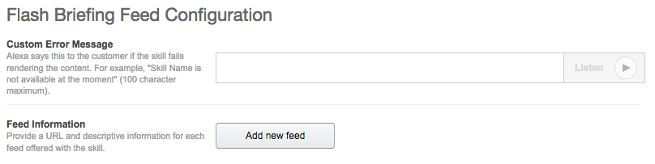
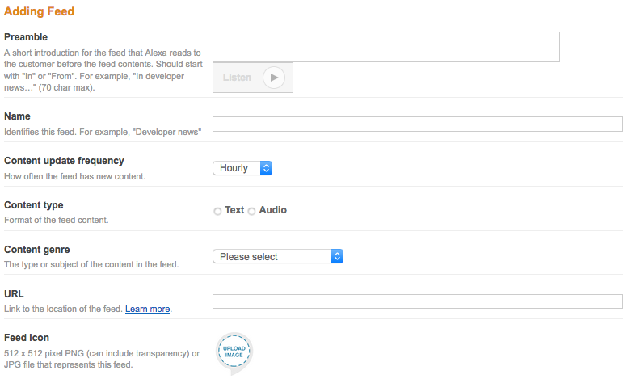

# Build An Alexa Flash Briefing Skill

## Connecting Your Flash Briefing Skill To Your API Endpoint

In [Voice User Interface](./1-voice-user-interface.md) step we created our skill.  In [Lambda Function](./2-lambda-function.md) step we created a Lambda function and API Endpoint for the skill. In this step, we connect those two pieces together.

1.  Go back to the **[Amazon Developer Portal](https://developer.amazon.com/edw/home.html#/skills/list)** and select your skill from the list. You may still have a browser tab open if you started at the beginning of this tutorial.

2.  Open the **Configuration** tab on the left side.

    

3.  Enter a **Custom Error Message**, then click **Add new feed**.

    

4. Fill out the **Feed Information** screen. Make sure to review the **Feed Information Tips** below this screenshot.

   

	### Feed Information Tips

    - **Preamble** Enter an appropriate preamble.
    - **Name** The name is only shown in the developer portal.
    - **Content update frequency** This template provides an update daily.
    - **Content type** Select the **Text** option.
    - **Content genre** Choose the appropriate genre.
    - **URL** Enter the **Invoke URL** you created in the [Lambda Function step](./2-lambda-function.md) of this guide.
	- **Feed Icon** Upload your skill's 512x512px icon. You can find detailed instructions for icons in the [Publication step](6-publication.md).

5.  Click the **Save** button, then click on **Next** to move to the **Testing** screen.

	

6.  In our next step of this guide, we will be testing the flash briefing skill.

  

