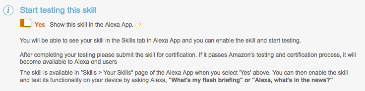

# Build An Alexa Flash Briefing Skill

## Testing Your Flash Briefing Skill

So far, we have [created a skill](./1-voice-user-interface.md) and [a Lambda function/API Endpoint](./2-lambda-function.md), and [connected the two together](./3-connect-vui-to-code.md). Your skill is now ready to test.

1.  **Go back to the [Amazon Developer Portal](https://developer.amazon.com/edw/home.html#/skills/list) and select your skill from the list.** You may still have a browser tab open if you started at the beginning of this tutorial.

2.  **Open the "Test" tab on the left side.**

    

3.	**Enable Testing by clicking on the slider button.**

	

4.  **Testing methods for flash briefing skills:**

	The current version of the testing tools available in the Alexa developer portal do not support flash briefing skills. Your options for testing include:

    *  [Alexa Enable Devices](https://www.amazon.com/Amazon-Echo-And-Alexa-Devices/b/?node=9818047011&ref=sxts_snpl_4_1_3479691842&qid=1518296182&pf_rd_m=ATVPDKIKX0DER&pf_rd_p=3479691842&pf_rd_r=ETDWTHJCZQGN3D3QGZHQ&pd_rd_wg=1ezr6&pf_rd_s=desktop-signpost&pf_rd_t=301&pd_rd_w=zEOTK&pf_rd_i=alexa&pd_rd_r=90889909-b1b1-448b-9857-0c3d97d10074) such as an Amazon Echo or Sonons One, or friends and family that own an Alexa enabled device. 
    *  [Echosim.io](https://echosim.io) - a browser-based Alexa skill testing tool that makes it easy to test your skills without carrying a physical device everywhere you go.
    *  [Unit Testing with Alexa](https://github.com/alexa/alexa-cookbook/tree/master/testing/postman/README.md) - a modern approach to unit testing your Alexa skills with [Postman](http://getpostman.com) and [Amazon API Gateway](http://aws.amazon.com/apigateway).

5.  **If your flash briefing skill is working properly, you can now customize your skill.**

  

