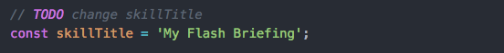
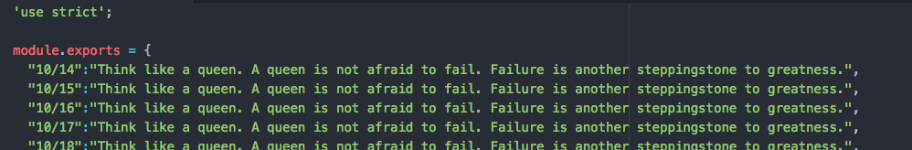

# Build An Alexa Flash Briefing Skill
[](./1-voice-user-interface.md)[](./2-lambda-function.md)[](./3-connect-vui-to-code.md)[](./4-testing.md)[](./5-customization.md)[](./6-publication.md)

## Required Customization

### Replace the Provided Data with Your Own

1. Modify the Node.js code to edit the **skill's title**.

	

	- Open ```./lambda/src/index.js```
	- Edit the **skillTitle** constant
	- Save the file

2. Modify the Node.js code to edit the **daily data**.

	

	- Use this [Google Sheets template](https://docs.google.com/spreadsheets/d/1_pitjZcZ46vReytXG2sAOg4eD5U2VS_Pe83a1-PoKIQ/edit?usp=sharing) to ease the creation of your data.
	- Open```./lambda/src/data.js```
	- Replace the existing data your own
	- Save the file

3. **Archive the Lambda function code**. Navigate into the `/lambda/src` directory and run the npm command: `npm run zip`. This will overwrite or create `/lambda/index.zip`.

	```bash
	$ npm run zip
	```

4.  **Upload the code**.
  * Open your skill's Lambda funciton in the AWS [Lambda Management Console](https://console.aws.amazon.com/lambda/home).
  * Under **code entry type** select **Upload a .ZIP file**.
  * **Upload** the **lambda/index.zip** file you just created.
  * Click **Save**.

5. **Test** your updated skill using the same methods in the [Testing](./4-testing.md) step and resolve any errors or issues as needed.

5. Move on to the [Publication](./6-publication.md) step.

<br/><br/>
<a href="./6-publication.md"></a>
